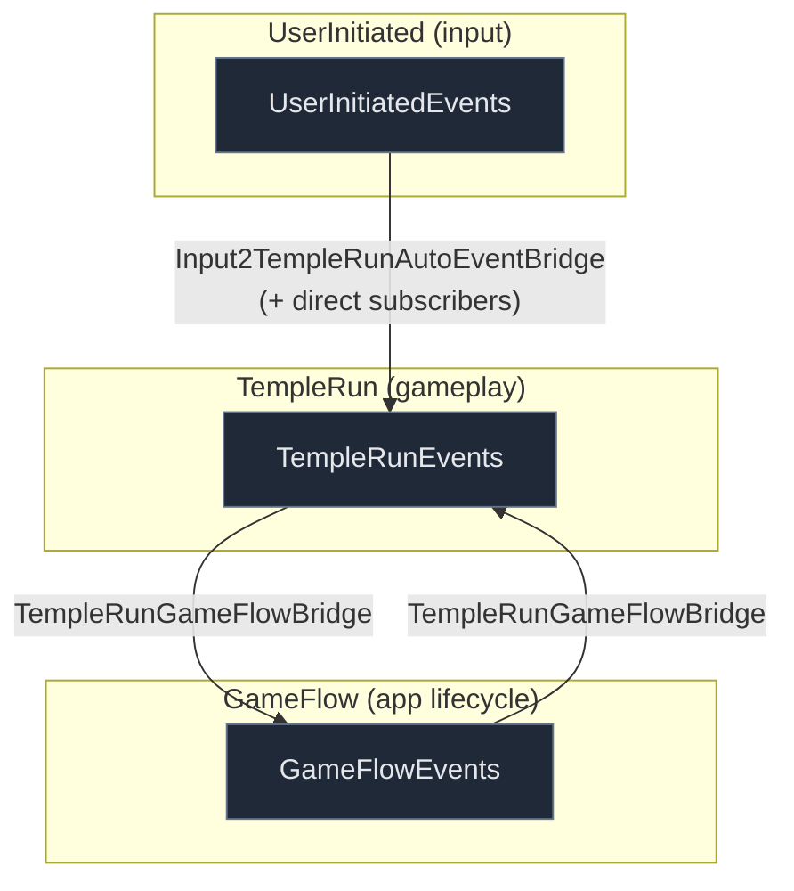
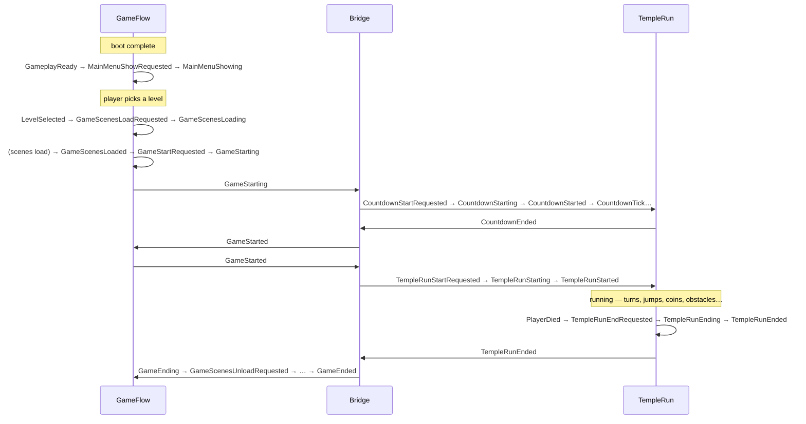
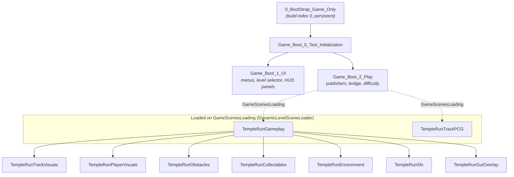

# Architecture

How the pieces fit together. For the concrete event lists see [EVENTS.md](EVENTS.md); for the
track system see [TRACKS.md](TRACKS.md); for the AI-assistant conventions see
[../CLAUDE.md](../CLAUDE.md).

## The big idea

Most Unity tutorials wire systems together with direct references: the input script calls a
method on the player, the player calls the score UI, the UI pokes the game manager. It works
at small scale and then rots — every system knows about every other system, and no piece can
change without breaking its neighbors.

This template takes the opposite discipline to its logical end: **systems never reference
each other at all.** The only way anything happens is that one component *publishes* a named
event on a shared bus and other components *subscribe* to it. This is the classic
**publish/subscribe** (observer) pattern, applied uniformly:

```csharp
// The slide input doesn't know a slide controller exists:
EventsPublisherUserInitiated.Instance.PublishEvent(UserInitiatedEvents.UserSlideRequested, this, null);

// The slide controller doesn't know what asked for the slide:
EventsPublisherTempleRun.Instance.SubscribeToEvent(TempleRunEvents.SlideStarting, OnSlideStarting);
```

What that buys:

- **Decoupling.** Publisher and subscriber compile independently; neither holds a reference
  to the other. Swap the input system, the visuals, or the whole player and nothing else
  notices.
- **Extension without modification.** Adding "play a sound on jump" is a *new* subscriber to
  `JumpStarted` — zero edits to the jump controller (the open/closed principle in practice).
- **Observability.** Because everything is an event, turning on event logging shows the whole
  game narrating itself, which makes debugging cross-system behavior far easier than stepping
  through call stacks.

The cost is indirection: you can't ctrl-click from cause to effect, and an event with no
subscriber fails silently. The template mitigates that with strict naming conventions, a
checked-in [event catalog](EVENTS.md), and audit tooling (`/audit-events`).

## Design vocabulary

Patterns you will recognize from a software-design course, and where each one lives here:

| Pattern / principle | Where it shows up |
|---------------------|-------------------|
| Publish/subscribe (observer) | The entire event bus: `EventsPublisher*.PublishEvent` / `SubscribeToEvent` |
| Singleton | The three publishers (`EventsPublisher*.Instance`), `Blackboard.Instance` — initialized first via `[DefaultExecutionOrder(-10000)]` |
| Bridge (between subsystems) | `TempleRunGameFlowBridge` — the *single* sanctioned crossing between the gameplay and app-lifecycle domains |
| Lifecycle as a naming state machine | Every action is a `Requested → *ing → *ed` event chain, with `*Failed` / `*Cancelled` off-ramps |
| Declarative control flow | Auto-chains: dictionaries mapping event → next event (`*AutoEventFlow.cs`), instead of imperative sequencing code |
| Data-driven design | Track segments/levels as ScriptableObjects ([TRACKS.md](TRACKS.md)); tuning configs per mechanic |
| Separation of data, loading, and use | Authoring SOs → `TrackLibraryLoader` → runtime `TrackSegmentLibrary`; the authored asset is never mutated |
| Blackboard | `Blackboard.Instance` — shared runtime gameplay state written and read via well-known properties |
| Model/view separation | Gameplay logic scenes vs. visuals/audio scenes; visuals subscribe to logic events, never the reverse |
| Object pooling / recycling | Track segments and spawned prefabs are recycled as the player advances |

## Event domains

Every system communicates through a typed event bus. Each domain owns an enum and a singleton
publisher; nothing calls across domains directly except the one bridge.



- **Auto-chains** move events *within* a domain (e.g. `PauseRequested → Pausing → Paused`).
- **The bridge** (`TempleRunGameFlowBridge`) is the single sanctioned crossing between
  TempleRun and GameFlow. Domain code translates a foreign event into a local one there,
  then subscribes to the local event. See the [Domain Isolation Rule](../CLAUDE.md#domain-isolation-rule).

## A run, end to end

The happy path from boot to a running game, showing which domain each step lives in and where
the bridge hands off.



## Scene composition

Scenes load **additively** from a single persistent bootstrap scene. Gameplay logic is split
from its visual, audio, and environment scenes so either can change independently.



### Load / unload mechanics

Scene orchestration is data-driven from Inspector components — there is no central scene
manager class:

| Component | Role |
|-----------|------|
| `LoadSceneAdditively` | unconditional additive load in `Start()` (the boot chain) |
| `DynamicLevelSceneLoader` | on `GameScenesLoading`, loads `GameState.SelectedLevel.GameplaySceneName` + `TempleRunTrackPCG` |
| `FireEventAfterSceneLoads` | waits for a set of scenes to load, then fires a completion event (this is what produces `GameScenesLoaded`) |
| `UnloadNonActiveScenes` | on `GameEnded`, unloads every scene with `buildIndex > _lastSceneIndexToKeep`, then publishes `GameScenesUnloaded` |
| `CloseSceneOnEvent` / `FireEventWhenSceneCloses` | per-scene self-unload / unload notification |

> ⚠️ **Build-order dependency.** `UnloadNonActiveScenes._lastSceneIndexToKeep` relies on the
> gameplay scenes being **last** in the Build Settings scene list, and the boot chain being
> first. The entry scene must be build index 0. If you reorder Build Settings, re-check the
> keep-index. See [KNOWN_ISSUES.md](KNOWN_ISSUES.md).

## Track generation (summary)

The endless track is produced by a three-stage pipeline whose stages communicate only through
events — selection (`TrackManager` picks the next abstract segment from a data-driven
library), geometry (`PathProvider` turns it into an Entrance → Pivot → Exit spline), and
visuals (`PrefabSpawner*` builds and recycles the meshes, obstacles, and pickups). Segments
and per-level rulesets are authored as ScriptableObjects and selected by tag/difficulty at
runtime. Full detail, data model, and geometry math: [TRACKS.md](TRACKS.md).

## Where things live

```
Assets/
├── _Common/    shared config (DifficultyConfig), AutoEventFlowBase placeholder, utilities
├── GameFlow/   app lifecycle: events, bridge, menus/level-select, scene management, progress
└── TempleRun/  gameplay: events, player mechanics, track generation, input, visuals
```

See [../CLAUDE.md](../CLAUDE.md) for the full folder breakdown and file reference.
