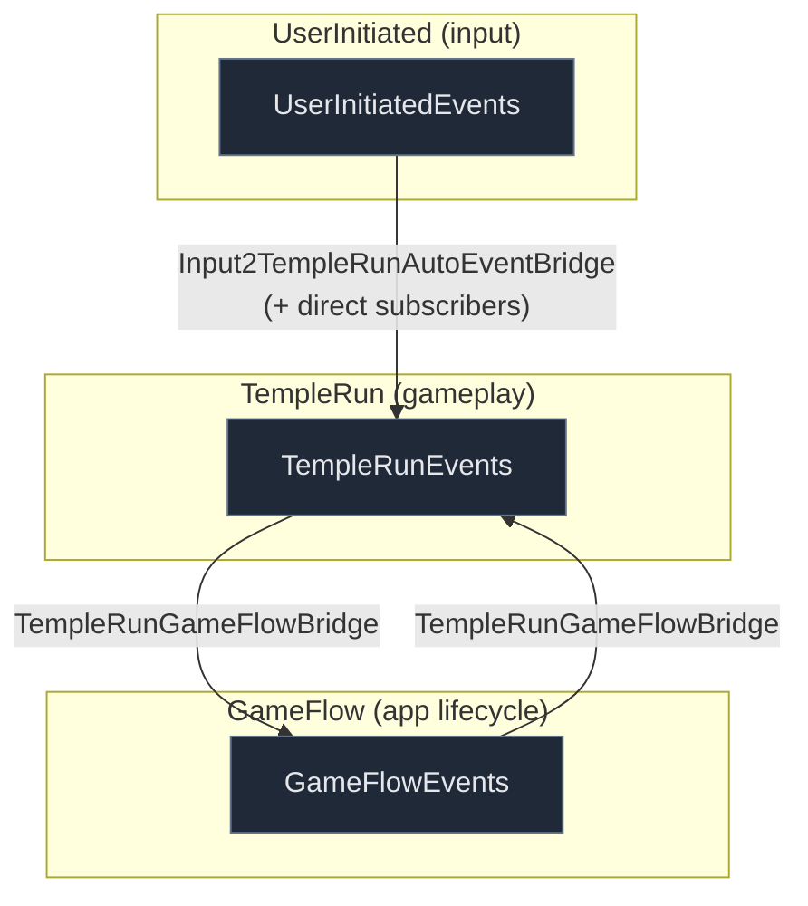
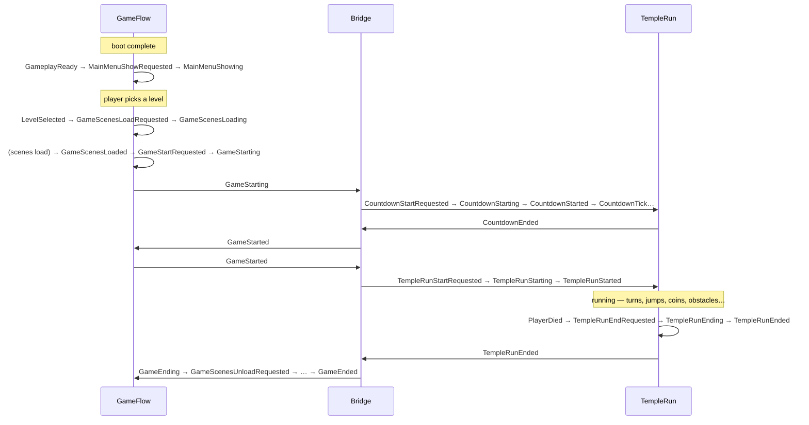
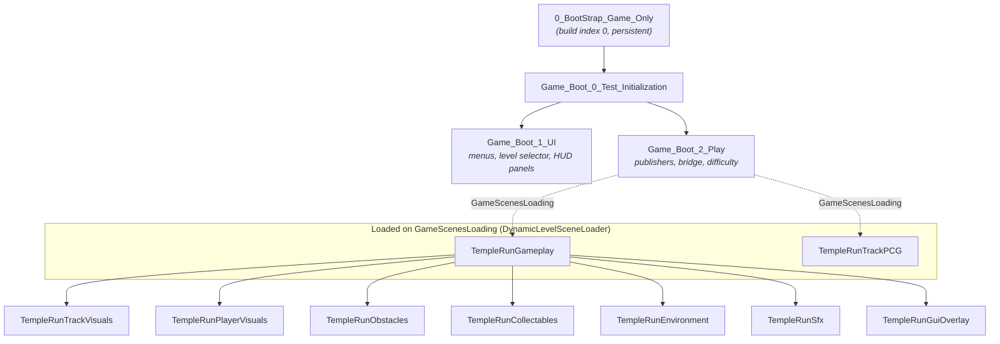

# Architecture

How the pieces fit together. For the concrete event lists see [EVENTS.md](EVENTS.md); for the
track system see [TRACKS.md](TRACKS.md); for the AI-assistant conventions see
[../CLAUDE.md](../CLAUDE.md).

## Event domains

Every system communicates through a typed event bus. Each domain owns an enum and a singleton
publisher; nothing calls across domains directly except the one bridge.



- **Auto-chains** move events *within* a domain (e.g. `PauseRequested → Pausing → Paused`).
- **The bridge** (`TempleRunGameFlowBridge`) is the single sanctioned crossing between
  TempleRun and GameFlow. Domain code translates a foreign event into a local one there,
  then subscribes to the local event. See the [Domain Isolation Rule](../CLAUDE.md#domain-isolation-rule).

## A run, end to end

The happy path from boot to a running game, showing which domain each step lives in and where
the bridge hands off.



## Scene composition

Scenes load **additively** from a single persistent bootstrap scene. Gameplay logic is split
from its visual, audio, and environment scenes so either can change independently.



### Load / unload mechanics

Scene orchestration is data-driven from Inspector components — there is no central scene
manager class:

| Component | Role |
|-----------|------|
| `LoadSceneAdditively` | unconditional additive load in `Start()` (the boot chain) |
| `DynamicLevelSceneLoader` | on `GameScenesLoading`, loads `GameState.SelectedLevel.GameplaySceneName` + `TempleRunTrackPCG` |
| `FireEventAfterSceneLoads` | waits for a set of scenes to load, then fires a completion event (this is what produces `GameScenesLoaded`) |
| `UnloadNonActiveScenes` | on `GameEnded`, unloads every scene with `buildIndex > _lastSceneIndexToKeep`, then publishes `GameScenesUnloaded` |
| `CloseSceneOnEvent` / `FireEventWhenSceneCloses` | per-scene self-unload / unload notification |

> ⚠️ **Build-order dependency.** `UnloadNonActiveScenes._lastSceneIndexToKeep` relies on the
> gameplay scenes being **last** in the Build Settings scene list, and the boot chain being
> first. The entry scene must be build index 0. If you reorder Build Settings, re-check the
> keep-index. See [KNOWN_ISSUES.md](KNOWN_ISSUES.md).

## Where things live

```
Assets/
├── _Common/    shared config (DifficultyConfig), AutoEventFlowBase placeholder, utilities
├── GameFlow/   app lifecycle: events, bridge, menus/level-select, scene management, progress
└── TempleRun/  gameplay: events, player mechanics, track generation, input, visuals
```

See [../CLAUDE.md](../CLAUDE.md) for the full folder breakdown and file reference.
