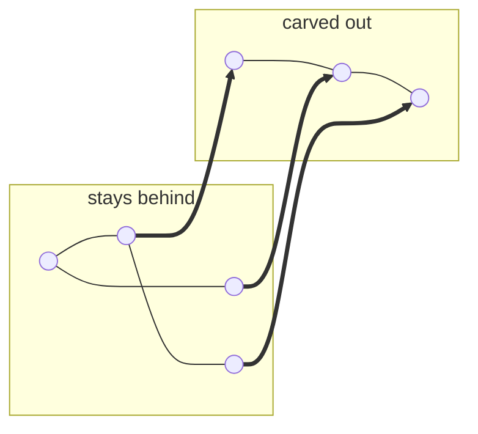
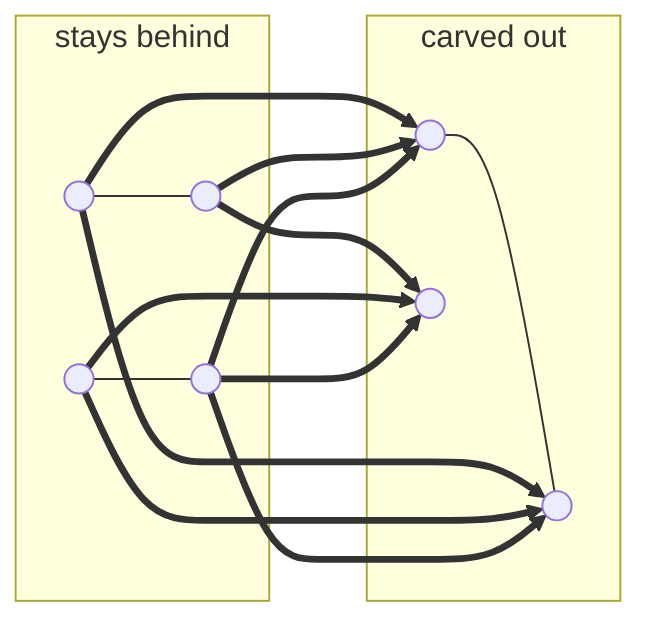

# Draw the Boundary

> **An ungraded, in-class team exercise.** Your team proposes splitting the gameplay event
> domain into subdomains, then defends **the arrows you cut** — and the replaceability they
> buy. Run it in one studio session: each team presents its cut and its bridge table, and
> the room presses with the questions below. Nothing merges; the deliverable is the argument.

*CSE 5912 · The AI-Driven Studio · Systems & Seams. Do this **after** the
[ADDING_A_MECHANIC](ADDING_A_MECHANIC.md) walkthrough — you can't cut what you haven't seen
whole.*

## The setup

The template's event architecture is three domains and one law:
`UserInitiatedEvents` → `TempleRunEvents` → `GameFlowEvents`, and no code may touch another
domain's events except inside a bridge. The whole law fits in a box:

```
TempleRun code  may reference only  TempleRunEvents.
GameFlow code   may reference only  GameFlowEvents.
Raw input is published by anyone, but subscribed to ONLY by the input bridge.
Every crossing lives in a bridge — TempleRunGameFlowBridge.cs, ten mappings;
                                   Input2TempleRunAutoEventBridge.cs, nine.
```

`TempleRunEvents` has grown to **120 events** in one enum, and every feature your studio
ships this term will touch that file. Should it be split into subdomains — `TrackEvents`,
`PowerUpEvents`, `MovementEvents`? Maybe. Smaller files, clear ownership, and fewer merge
conflicts come along for the ride, but they are not the goal. **The goal is
replaceability:** a domain behind a real boundary can be swapped wholesale — a totally
different track generator — or stubbed out with a trivial fake, and the rest of the game
never notices. The template makes this concrete: a domain's systems live in
additively-loaded scenes, so replacing a domain is loading a different scene that speaks
the same events. But *boundaries are paid for in bridges*: every interaction that crosses
the line you draw becomes a bridge mapping someone must write, name, and maintain forever.

There is a second ledger, though. A boundary is also a *capture point*: everything that
crosses one seam can be logged, replayed, and analyzed as a unit. Sometimes what the stream
is *worth* matters as much as how thin it is — hold that thought for the closing precedent.

## The picture

Dots are systems; lines are event interactions. The same code, two proposed cuts. A
boundary is good where the seam is already quiet.

**A quiet seam — 3 crossings, worth a bridge:**



**A chatty cut — 9 crossings, a boundary tax on every feature:**



## What your team brings to the discussion

One short proposal document (markdown, in your repo). Ungraded — the deliverable is the
argument. It contains, in order:

1. **The boundary.** Name the subdomain(s) you would carve out of `TempleRunEvents` and
   list exactly which event categories move (use the value ranges from
   [EVENTS.md](EVENTS.md)).
2. **The bridge table — this is the heart of it.** Every event that crosses your boundary:
   source event, direction, payload type, and why the crossing exists. This is the table
   someone would actually paste into a new bridge class. Count the rows. Honestly.
3. **Shared payload types.** Which types (`TrackSegmentInfo`, `Direction`, …) both sides
   still compile against. An enum split does not split data coupling — say what still binds
   you.
4. **The stub test.** Describe the smallest fake that could sit behind your boundary and
   keep the game running — an endless straight track, say, published through the same
   events. What must it publish, and what may it ignore? If a paragraph can't describe the
   stub, the contract is incomplete; if `Blackboard` state or a shared type sneaks around
   the events, you've found a hidden coupling.
5. **Lifetime and law.** Which scene hosts the new auto-flow/bridge (match component
   lifetime to domain lifetime), and restate the domain-isolation rule for your new set of
   domains in one or two sentences. If you can't state it in two, the boundary is wrong.
6. **Migration risk.** Serialized event names are `"EnumName/Member"` strings baked into
   scenes and prefabs. Say what breaks, and evaluate the `[EventEnum(Prefix = …)]` escape
   hatch — including why its silent name-sharing is a hazard.
7. **The second ledger.** If every event crossing your boundary were timestamped and
   logged, what could the team rebuild or learn from that stream? Answer for your cut
   specifically.

> **Where the data lives:** run the `list-events` skill (or read [EVENTS.md](EVENTS.md))
> for the full catalog with auto-chains and bridge mappings; the Domain Registry table sits
> at the top of [CLAUDE.md](../CLAUDE.md)'s Architecture Overview; the decision gate for
> new domains is Step 0 of
> [`.claude/skills/add-event-domain/SKILL.md`](../.claude/skills/add-event-domain/SKILL.md).
> All of it is plain markdown — every AI tool, and every human, can read it.

> **Worked examples of the law being broken:** the
> [Event Seam Audit](event-review/event-seam-audit.html) catalogues five recurring ways a
> system reaches past its own boundary in this very codebase, and
> [The Half-Wired Chain](event-review/the-half-wired-chain.html) walks six of them as shipped
> code beside the fix. Read at least the audit's "The pattern, named" section before you draw
> your cut — every form in it is a crossing someone did not realise they were making.

## How to judge a proposal

Nothing here is graded — so judge each other. In discussion, press every proposal on these,
roughly in this order of weight:

| Press on | A strong answer |
|----------|-----------------|
| Honest crossing count | The bridge table is complete — auto-chains and existing bridge mappings traced, no crossing waved away. A high count honestly reported beats a low count achieved by missing arrows. |
| Boundary quality | The cut lands on a quiet seam: few crossings, a one-sentence isolation law, a plausible ownership story for a sub-team. |
| Payload coupling | Shared types identified; the proposal is clear-eyed that the enum split leaves them shared. |
| The stub test | They can sketch the trivial replacement that keeps the game running — and name the hidden couplings (shared `Blackboard` state, shared types) that would break it. |
| Migration realism | Serialized-name breakage understood; the Prefix lever weighed with its hazard, not hand-waved. |
| The second ledger | The team can say what their boundary's stream is worth capturing — or admit it isn't. |
| The closing question | "What got cheaper, and what now pays the tax?" has a crisp answer. |

## Candidate boundaries to evaluate

Evaluate at least two. At least one of these is a trap — the count will tell you which.

| Candidate | Events | First read |
|-----------|--------|------------|
| **Track / PCG** — splines, segments, geometry | ≈ 200–350 | *Promising seam.* Own scene, own data model, and three `TrackManager` variants already shipping. A totally different generator behind the same events is the dream — count what it costs. |
| **Power-ups** — collect/activate lifecycles + effects | ≈ 160–185 | *Plausible.* Already strategy-pattern isolated behind `IPowerUpEffect`. |
| **Movement** — turn / jump / slide / dash / lane | ≈ 50–107 | *Count it and see.* How often does movement talk to track, distance, and player lifecycle? |
| **Difficulty** — bridged + direct difficulty groups | ≈ 300–323 | *Discuss.* Two vocabularies exist today (310–318 and 320–323). Is that a boundary, or a cleanup? |

## The precedent

Study `UserInitiatedEvents` before you write a word — it is a split that pays all three
ways. The seam is real: raw input earned its own enum at the cost of exactly one small
bridge (`Input2TempleRunAutoEventBridge`, nine mappings — one per input event, and the only
subscriber to raw input in the codebase). It is *replaceable*, and the
repo already proves it: `AIController` — a deterministic autopilot that reads the upcoming
turn and fires at the last safe moment — publishes `UserLeftTurnRequested` /
`UserRightTurnRequested` through the same bus, exactly as the human's input actions do.
Something else sits in the human's seat, nothing downstream knows — and the same mechanism
would drive a recorded playthrough. And it is a *capture point*: those nine events are the
complete record of player intent. Timestamp that stream and keep the run's random seed —
the template already vendors seed control (`RandomProvider`, `fixedSeedsList.asset`) — and
you can reconstruct an entire playthrough: ghost runners, demo playback, bug reproductions,
regression tests, with no video and no state snapshots. (Discussion: what else must be true
of the simulation for that replay to be faithful?)

A boundary pays rent three ways — by cutting few arrows, by seating something you can
replace, and by carrying a stream worth recording.

---

*A convincing proposal may still be implemented later through the `add-event-domain`
skill, whose decision gate is this exercise in miniature.*
