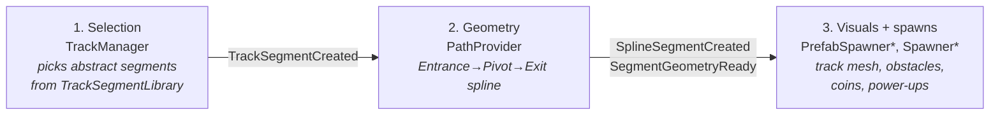
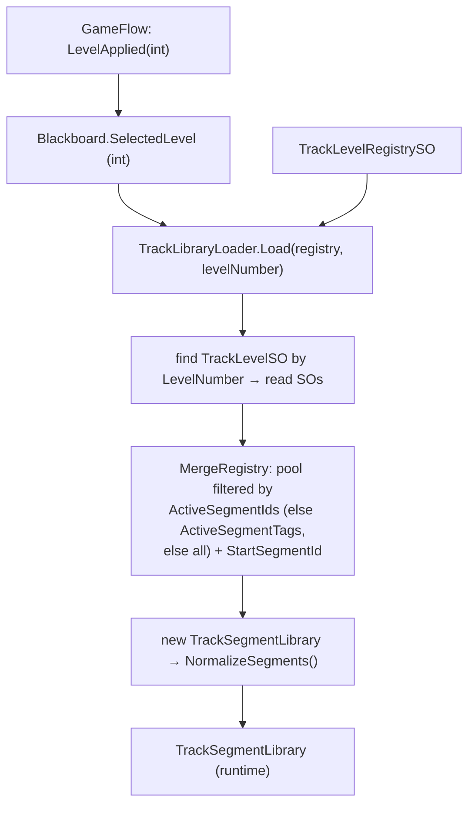

# Track Generation

The track is generated procedurally from **segments** authored as ScriptableObjects, selected at
runtime by a per-level ruleset. This doc covers the pipeline, the data model, the asset shape, and
the geometry math. Source: `Assets/TempleRun/Scripts/Track/`, authored assets in
`Assets/TempleRun/Scriptables/Track/`.

## Pipeline

Three decoupled stages, communicating only through events:



1. **Selection** — `TrackManager` keeps a look-ahead queue, asks `TrackSegmentLibrary` for the
   next segment (weighted, optionally difficulty-gated), and publishes `TrackSegmentCreated`
   plus `ActiveTrackChanging` as the player advances.
2. **Geometry** — `PathProvider` converts each abstract segment into a concrete
   Entrance → Pivot → Exit spline (axis-aligned 90° turns) and publishes `SplineSegmentCreated`
   (visual geometry) and `SegmentGeometryReady` (full geometry incl. pivot/exit).
   `SegmentTransitionController` and `SegmentAdvanceTrigger` drive the per-segment
   enter/exit lifecycle from travelled distance.
3. **Visuals & spawns** — `PrefabSpawnerAbstract` subclasses build/recycle the track mesh;
   `SpawnerBase` subclasses (obstacles, coins, power-ups) place objects per the segment's
   spawn mode. `SpawnPrefabRegistry` maps `PrefabTag` strings → prefabs.

## The data model

Four authoring ScriptableObjects, mirroring the `LevelConfig` / `LevelRegistry` pattern. Segments
are authored once in a shared **registry**; each **level** is a thin ruleset that selects a subset
of the registry by tag or id; a **level registry** maps a level number to its ruleset.

- **Segment** — `TrackSegmentSO` (one asset per segment, in `Scriptables/Track/Segments/`): the
  authored fields for a single segment, including a real `Direction` enum (Inspector dropdown).
- **Segment registry** — `TrackSegmentRegistrySO`: an array of `TrackSegmentSO`, the full shared pool.
- **Level ruleset** — `TrackLevelSO`: a `LevelNumber`, a `Registry` reference, a `StartSegmentId`,
  lane config, and either `ActiveSegmentTags` or `ActiveSegmentIds` to filter the pool.
- **Level registry** — `TrackLevelRegistrySO`: an array of `TrackLevelSO`, resolved by `LevelNumber`.

The SOs are **pure data — no logic**. They are the *input*. A separate *reading* layer,
`TrackLibraryLoader`, turns them into runtime objects (`TrackSegmentDefinition` /
`TrackSegmentLibrary`), which are what everything downstream *uses*. Because the loader emits
**fresh, mutable** copies, normalization — which writes into the definition — never touches the
authored asset. Keeping input, reading, and using separate is deliberate.

**The GameFlow seam is a plain `int`.** GameFlow never references a track type: selecting a level
publishes `LevelApplied(int)` (the `LevelConfig.LevelNumber`), which is bridged to
`TempleRunLevelApplied` and stored on `Blackboard.SelectedLevel`. It rests there because it arrives
before the gameplay scene — and `TrackManager` — exists.

Loading (`TrackLibraryLoader.Load` at `TrackManager` init):



`TrackManager` reads `Blackboard.SelectedLevel` at init and asks the loader for the library; a null
result (no level selected) leaves the procedural fallback in charge. The resolved library lives on
`TrackManager` — never on the Blackboard.

## Segment geometry: the 3-point model

Every segment is **Entrance → Pivot → Exit**:

```
Entrance ──ToPivotDistance──▶ Pivot ──ExitDistance──▶ Exit
                               (turn)   (post-turn run-out)
```

| Field | Meaning |
|-------|---------|
| `Direction` | authored turn direction: `Straight` \| `Left` \| `Right` \| `Either`. A real enum set directly on the SO (Inspector dropdown) — no string parsing, no field/key drift. Every rule in `Normalize` branches on it. |
| `ToPivotDistance` | distance from Entrance to Pivot (the turn point). For `Straight`, Pivot == Exit so this equals `Length`. |
| `ExitDistance` | distance from Pivot to Exit in the post-turn direction. `0` for Straight; `> 0` for Left/Right/Either. |
| `Length` | total segment length. Recomputed as `ToPivotDistance + ExitDistance` when `ExitDistance > 0`. |
| `TurnFailureDistance` | how far past the pivot the player may go before failing a required turn. `float.MaxValue` for Straight; else `ToPivotDistance + 1`, clamped to `Length - TurnFailureMarginBeforeExit` so it stays strictly inside the segment. |
| `TeleportDistance` | where the player "lands" after the turn animation, measured from the pivot. Must be `< ExitDistance`. Defaults to `ExitDistance * 0.5`. |

### Normalization rules (`Normalize`, run once per definition)

```
// Direction is already set by the authoring SO; every rule below branches on it
if ToPivotDistance <= 0:  ToPivotDistance = Length
if Direction == Straight:
    ExitDistance = 0                 // error if authored non-zero; a Straight ends at its pivot
    TurnFailureDistance = float.MaxValue
else:
    if ExitDistance <= 0: ExitDistance = MinimumTurnExitDistance   // error; a turn needs a run-out
Length = ToPivotDistance + ExitDistance
if Direction != Straight:
    if TurnFailureDistance <= 0: TurnFailureDistance = ToPivotDistance + 1
    TurnFailureDistance = min(TurnFailureDistance, Length - TurnFailureMarginBeforeExit)
if TeleportDistance <= 0 and ExitDistance > 0: TeleportDistance = ExitDistance * 0.5
```

`TrackSegmentLibrary.Normalize(definition)` is the **single boundary** where segment data becomes
trustworthy. Every construction path must pass through it — including definitions built inline at
runtime, such as `TrackManager`'s procedural fallback, which otherwise ends up with
`TurnFailureDistance == 0` and fails its turn on the first frame. Downstream code (geometry
builders, controllers) may assume these invariants hold rather than re-checking them:

| Invariant | |
|---|---|
| `Length` | `== ToPivotDistance + ExitDistance` |
| `Straight` | `ExitDistance == 0`, `TurnFailureDistance == MaxValue` |
| `Left`/`Right`/`Either` | `ExitDistance > 0`, `TurnFailureDistance < Length` |
| `TeleportDistance` | `> 0` exactly when `ExitDistance > 0` |

A turn with `ExitDistance == 0` used to collapse its exit sub-spline to a single point — no
direction to face, nothing to build — which `AxisAligned90Builder.BuildEitherExit` special-cased
while `BuildTurn` did not. The invariant removes the case rather than checking for it in each
builder.

> **Why the clamp matters.** `SegmentExited` fires at `Length` and immediately re-arms
> `TurnCollisionDetector` for the next segment, so a `TurnFailureDistance` at or past `Length`
> is never observed and a missed turn goes undetected — the player just sails through. Segments
> with a short `ExitDistance` hit this by default: `left_16` (`ToPivotDistance` 15 / `ExitDistance`
> 1) gives `Length` 16 and a default failure distance of 16. The clamp keeps the failure point
> strictly inside the segment.

> **Why ScriptableObjects.** Segments used to be authored as JSON parsed by `JsonUtility`, which
> binds by exact field name and silently drops mismatches — a hazard that produced several real
> bugs (an enum authored as a string that defaulted every segment to `Direction.Left`; a renamed
> field that fell back to `ToPivotDistance = Length`). Native SO serialization removes the whole
> class: enums get an Inspector dropdown, renames are compile-time-safe, and key/field drift is
> impossible. See [KNOWN_ISSUES.md](KNOWN_ISSUES.md).

## Selection at runtime

`TrackSegmentLibrary.SelectNext(previousId, repeatCount, random, targetDifficulty, range)`:

1. If the previous segment has explicit `Connections`, candidates are limited to those.
   Otherwise all active segments are candidates.
2. `MaxRepeat` filters out a segment that would repeat too many times consecutively.
3. When `targetDifficulty >= 0`, candidates are gated to `DifficultyRating` within `± range`
   (falls back to ungated if that leaves nothing).
4. A **weighted** random pick uses each segment's `Weight`.

## Asset fields

### Segment (`TrackSegmentSO`)

| Field | Notes |
|-------|-------|
| `Id` | unique id (used for connections, repeat tracking, start selection) |
| `Direction` | `Straight` \| `Left` \| `Right` \| `Either` — enum dropdown |
| `ToPivotDistance` | Entrance → Pivot. Leave 0 to mean "use the whole segment" (a Straight) |
| `ExitDistance` | Pivot → Exit. `0` for Straight; `> 0` for turns. `Length` is derived from these two, so the SO has no `Length` field |
| `Weight` | selection weight |
| `MaxRepeat` | max consecutive repeats (0 = unlimited) |
| `DifficultyRating` | used by difficulty gating |
| `Tags` | used by level tag-filtering |
| optional | `TeleportDistance`, `TurnFailureDistance`, `TurnRadius`, `Role`, `SpeedMultiplier`, `BlockedLanes`, `LaneHeights`, `ActiveLanes`, `SpawnMode`, `SpawnSlots`, `VisualTheme`, `SpawnSeed` — left at defaults, resolved by `Normalize` |

### Registry (`TrackSegmentRegistrySO`)

A single `Segments` array of `TrackSegmentSO` references — the shared pool every level draws from.

### Level ruleset (`TrackLevelSO`)

`LevelName`, `LevelNumber`, `DifficultyRating`, `LaneCount`, `LaneWidth`, a `Registry` reference, a
`StartSegmentId`, and one of `ActiveSegmentTags` / `ActiveSegmentIds` to filter the pool. `LevelNumber`
is how the level is resolved — GameFlow's `LevelConfig.LevelNumber` must match it.

### Level registry (`TrackLevelRegistrySO`)

A single `Levels` array of `TrackLevelSO` references, resolved by `LevelNumber`. Assign it to
`TrackManager._trackLevels`. This is the SO that maps the selected `int` to a track ruleset.

### Spawn slots (`SpawnSlotDefinition`, for Preset / Hybrid spawn modes)

`NormalizedPosition` (0–1 along the segment), `Lane` (0 = centre, ±n), `Height`, `Type`
(`Obstacle` \| `Coin` \| `PowerUp` \| `Hazard`), `PrefabTag` (resolved via `SpawnPrefabRegistry`),
`Weight` (Hybrid selection weight), `Required` (true = always; false = probabilistic).

## Either / T-junctions

A segment with `Direction: "Either"` presents a branch. `PathProvider` publishes only the
approach spline and stashes the pending exit; generation halts until the player commits with
`SegmentRequested` (data: `Direction`), then the exit geometry is resolved and re-published
with the same sequence index.

## Authoring

- **Inspector:** select a `TrackSegmentSO`, `TrackSegmentRegistrySO`, or `TrackLevelSO` asset in
  `Assets/TempleRun/Scriptables/Track/` and edit it directly. Create new ones via
  `Assets > Create > CrawfisSoftware > TempleRun > Track Segment` / `Track Segment Registry` /
  `Track Level`. Add a new segment to a level by adding it to the registry and tagging it (or
  listing its id in the level's `ActiveSegmentIds`).
- **Migration:** the segments and levels were converted from the legacy JSON by the one-shot
  `CrawfisSoftware > Track > Import JSON -> ScriptableObjects` importer
  (`Assets/TempleRun/Editor/TrackDataImporter.cs`).
