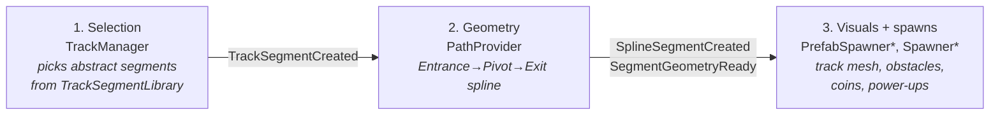
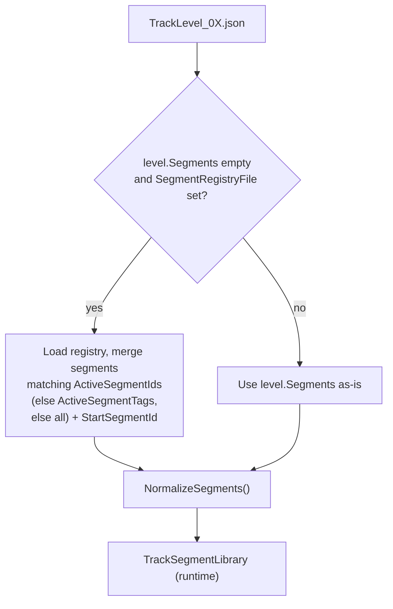

# Track Generation

The track is generated procedurally from JSON-authored **segments**, selected at runtime by a
per-level ruleset. This doc covers the pipeline, the data model, the JSON schema, and the
geometry math. Source: `Assets/TempleRun/Scripts/Track/`, data in
`Assets/TempleRun/Resources/`.

## Pipeline

Three decoupled stages, communicating only through events:



1. **Selection** — `TrackManager` keeps a look-ahead queue, asks `TrackSegmentLibrary` for the
   next segment (weighted, optionally difficulty-gated), and publishes `TrackSegmentCreated`
   plus `ActiveTrackChanging` as the player advances.
2. **Geometry** — `PathProvider` converts each abstract segment into a concrete
   Entrance → Pivot → Exit spline (axis-aligned 90° turns) and publishes `SplineSegmentCreated`
   (visual geometry) and `SegmentGeometryReady` (full geometry incl. pivot/exit).
   `SegmentTransitionController` and `SegmentAdvanceTrigger` drive the per-segment
   enter/exit lifecycle from travelled distance.
3. **Visuals & spawns** — `PrefabSpawnerAbstract` subclasses build/recycle the track mesh;
   `SpawnerBase` subclasses (obstacles, coins, power-ups) place objects per the segment's
   spawn mode. `SpawnPrefabRegistry` maps `PrefabTag` strings → prefabs.

## The two-file data model

Segments are authored once in a shared **registry**, and each **level** is a thin ruleset that
selects a subset of the registry by tag or id.

- **Registry** — `TrackSegments_Registry.json` (`TrackSegmentRegistryDefinition`): the full
  pool of `TrackSegmentDefinition`s.
- **Level ruleset** — `TrackLevel_*.json` (`TrackSegmentLibraryDefinition`): names a
  `SegmentRegistryFile`, a `StartSegmentId`, lane config, and either `ActiveSegmentTags` or
  `ActiveSegmentIds` to filter the pool. Its own `Segments` list is usually empty and filled
  by merging from the registry at load (`MergeRegistrySegments`).

Loading (`TrackSegmentLibrary.LoadFromResources`):



## Segment geometry: the 3-point model

Every segment is **Entrance → Pivot → Exit**:

```
Entrance ──ToPivotDistance──▶ Pivot ──ExitDistance──▶ Exit
                               (turn)   (post-turn run-out)
```

| Field | Meaning |
|-------|---------|
| `DirectionString` | authored turn direction: `Straight` \| `Left` \| `Right` \| `Either`. Parsed into the `Direction` enum by `NormalizeSegments`. **Must be a string field** — `JsonUtility` writes enums as integers and silently ignores a string aimed at an enum field, which would leave every segment at `Direction.Left` (value 0). |
| `ToPivotDistance` | distance from Entrance to Pivot (the turn point). For `Straight`, Pivot == Exit so this equals `Length`. |
| `ExitDistance` | distance from Pivot to Exit in the post-turn direction. `0` for Straight; `> 0` for Left/Right/Either. |
| `Length` | total segment length. Recomputed as `ToPivotDistance + ExitDistance` when `ExitDistance > 0`. |
| `TurnFailureDistance` | how far past the pivot the player may go before failing a required turn. `float.MaxValue` for Straight; else `ToPivotDistance + 1`, clamped to `Length - TurnFailureMarginBeforeExit` so it stays strictly inside the segment. |
| `TeleportDistance` | where the player "lands" after the turn animation, measured from the pivot. Must be `< ExitDistance`. Defaults to `ExitDistance * 0.5`. |

### Normalization rules (`NormalizeSegments`, run once at load)

```
Direction = parse(DirectionString)   // must run first — every rule below branches on it
if ToPivotDistance <= 0:  ToPivotDistance = Length
if Direction == Straight:
    ExitDistance = 0                 // error if authored non-zero; a Straight ends at its pivot
    TurnFailureDistance = float.MaxValue
else:
    if ExitDistance <= 0: ExitDistance = MinimumTurnExitDistance   // error; a turn needs a run-out
Length = ToPivotDistance + ExitDistance
if Direction != Straight:
    if TurnFailureDistance <= 0: TurnFailureDistance = ToPivotDistance + 1
    TurnFailureDistance = min(TurnFailureDistance, Length - TurnFailureMarginBeforeExit)
if TeleportDistance <= 0 and ExitDistance > 0: TeleportDistance = ExitDistance * 0.5
```

`TrackSegmentLibrary.Normalize(definition)` is the **single boundary** where segment data becomes
trustworthy. Every construction path must pass through it — including definitions built inline at
runtime, such as `TrackManager`'s procedural fallback, which otherwise ends up with
`TurnFailureDistance == 0` and fails its turn on the first frame. Downstream code (geometry
builders, controllers) may assume these invariants hold rather than re-checking them:

| Invariant | |
|---|---|
| `Length` | `== ToPivotDistance + ExitDistance` |
| `Straight` | `ExitDistance == 0`, `TurnFailureDistance == MaxValue` |
| `Left`/`Right`/`Either` | `ExitDistance > 0`, `TurnFailureDistance < Length` |
| `TeleportDistance` | `> 0` exactly when `ExitDistance > 0` |

A turn with `ExitDistance == 0` used to collapse its exit sub-spline to a single point — no
direction to face, nothing to build — which `AxisAligned90Builder.BuildEitherExit` special-cased
while `BuildTurn` did not. The invariant removes the case rather than checking for it in each
builder.

> **Why the clamp matters.** `SegmentExited` fires at `Length` and immediately re-arms
> `TurnCollisionDetector` for the next segment, so a `TurnFailureDistance` at or past `Length`
> is never observed and a missed turn goes undetected — the player just sails through. Segments
> with a short `ExitDistance` hit this by default: `left_16` (`ToPivotDistance` 15 / `ExitDistance`
> 1) gives `Length` 16 and a default failure distance of 16. The clamp keeps the failure point
> strictly inside the segment.

> **Gotcha: `JsonUtility` binds by exact field name.** The JSON key and the C# field must match
> character for character — `JsonUtility` silently drops anything it doesn't recognize, with no
> error. This bit us once already: the field and key drifted apart, so every segment fell back to
> `ToPivotDistance = Length`, quietly corrupting turn geometry. If you rename one, rename the other
> in the same commit, and remember `Assets/TempleRun/Resources/TrackSegments_Registry.json` is the
> file that has to change.

## Selection at runtime

`TrackSegmentLibrary.SelectNext(previousId, repeatCount, random, targetDifficulty, range)`:

1. If the previous segment has explicit `Connections`, candidates are limited to those.
   Otherwise all active segments are candidates.
2. `MaxRepeat` filters out a segment that would repeat too many times consecutively.
3. When `targetDifficulty >= 0`, candidates are gated to `DifficultyRating` within `± range`
   (falls back to ungated if that leaves nothing).
4. A **weighted** random pick uses each segment's `Weight`.

## JSON schema

### Registry (`TrackSegments_Registry.json`)
```jsonc
{
  "Version": "2.0",
  "Segments": [
    {
      "Id": "left_28",           // unique id
      "DirectionString": "Left", // Straight | Left | Right | Either — see note below
      "ToPivotDistance": 27.0,  // → Pivot
      "ExitDistance": 1.0,       // Pivot → Exit (0 for Straight)
      "Weight": 1.0,             // selection weight
      "MaxRepeat": 2,            // max consecutive repeats (0 = unlimited)
      "DifficultyRating": 1.0,   // used by difficulty gating
      "Tags": ["beginner"]       // used by level tag-filtering
      // optional: Length, Role, SpeedMultiplier, BlockedLanes, LaneHeights,
      //           ActiveLanes, SpawnMode, SpawnSlots, VisualTheme, SpawnSeed,
      //           TurnFailureDistance, TeleportDistance
    }
  ]
}
```

### Level ruleset (`TrackLevel_0X.json`)
```jsonc
{
  "Version": "2.0",
  "LevelName": "Beginner Temple",
  "LevelNumber": 1,
  "DifficultyRating": 1.5,
  "LaneCount": 3,
  "LaneWidth": 2.0,
  "SegmentRegistryFile": "TrackSegments_Registry",  // Resources name, no extension
  "StartSegmentId": "start",
  "ActiveSegmentTags": ["opening", "beginner"],     // OR use ActiveSegmentIds
  "ActiveSegmentIds": [],
  "Segments": [],       // usually empty → merged from registry by tag/id
  "Connections": []     // optional explicit adjacency: [{ "FromId": "...", "ToId": "..." }]
}
```

### Spawn slots (Preset / Hybrid spawn modes)
```jsonc
{
  "NormalizedPosition": 0.5,   // 0–1 along the segment
  "Lane": 0,                   // 0 = centre, negative = left, positive = right
  "Height": 0.0,
  "Type": "Obstacle",          // Obstacle | Coin | PowerUp | Hazard
  "PrefabTag": "crate",        // resolved via SpawnPrefabRegistry
  "Weight": 1.0,               // Hybrid selection weight
  "Required": true             // true = always; false = probabilistic
}
```

## Either / T-junctions

A segment with `Direction: "Either"` presents a branch. `PathProvider` publishes only the
approach spline and stashes the pending exit; generation halts until the player commits with
`SegmentRequested` (data: `Direction`), then the exit geometry is resolved and re-published
with the same sequence index.

## Authoring

- **Editor:** `CrawfisSoftware > Track Level Editor` — a three-panel window for editing the
  registry and level rulesets.
- **AI skill:** `/generate-segments` — prompt-driven segment creation into the registry by
  direction / length range / difficulty range / tags (reads the registry first to avoid
  duplicate ids and match naming like `left_28`).
